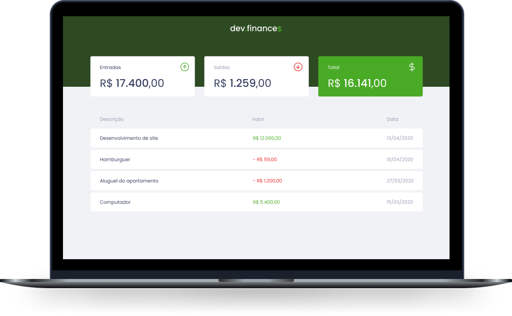

<h1 align="center">
  
</h1>

  <a href="#-tecnologias">Tecnologias</a>&nbsp;&nbsp;&nbsp;|&nbsp;&nbsp;&nbsp;
  <a href="#-projeto">Projeto</a>&nbsp;&nbsp;&nbsp;|&nbsp;&nbsp;&nbsp;
  <a href="#-layout">Layout</a>&nbsp;&nbsp;&nbsp;|&nbsp;&nbsp;&nbsp;
  <a href="#memo-licenca">Licença</a>

  
  

 

  

## 🚀 Tecnologias

Esse projeto foi desenvolvido com as seguintes tecnologias:

- HTML
- CSS
- JavaScript

## 💻 Projeto

O **devfinances** é uma aplicação de controle financeiro, onde é possível cadastrar e excluir transações e ver o saldo de entrada e saída 💰

## 🔖 Layout

Você pode visualizar o layout do projeto através desse link:

https://www.figma.com/file/7Vu9DzUaCZIV4nibzkjgB4/dev.finance%24-Maratona-Discover

É necessário ter conta no Figma para acessá-lo.

## :memo: Licença

Esse projeto está sob a licença MIT.  
Veja o arquivo **LICENSE.md** para mais detalhes.

---

Feito com ♥ by Rocketseat 👋  
Participe da comunidade:  
https://discord.gg/rocketseat

 
 

  

