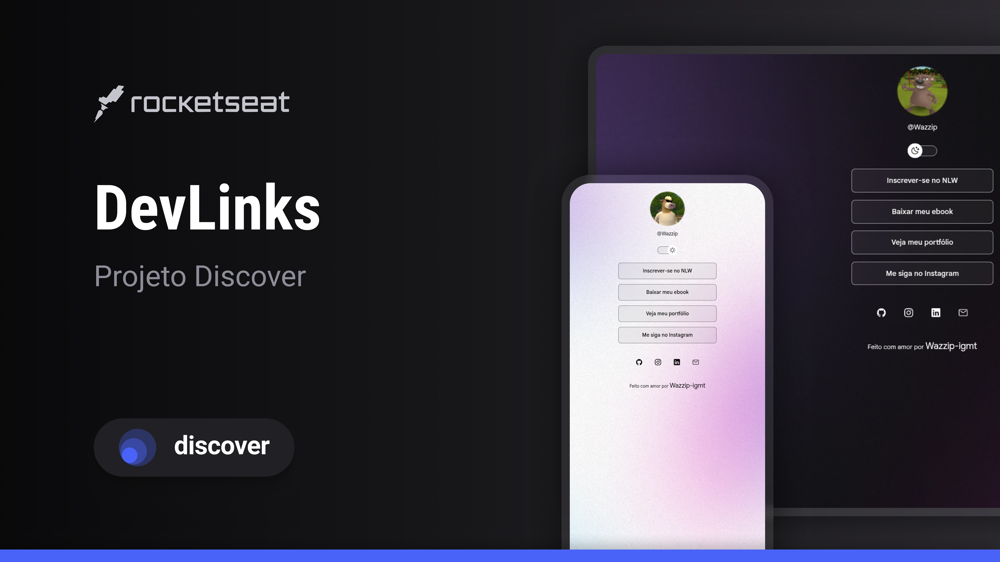

<h1 align="center">DevLinks</h1>

  Projeto desenvolvido durante meus estudos de desenvolvimento web.
   
  Um agregador de links simples e responsivo para reunir contatos e redes sociais em um único lugar.

  <a href="#-tecnologias">Tecnologias</a>&nbsp;&nbsp;&nbsp;|&nbsp;&nbsp;&nbsp;
  <a href="#-projeto">Projeto</a>&nbsp;&nbsp;&nbsp;|&nbsp;&nbsp;&nbsp;
  <a href="#-aprendizados">Aprendizados</a>&nbsp;&nbsp;&nbsp;|&nbsp;&nbsp;&nbsp;
  <a href="#-créditos">Créditos</a>

 

  

🚀 Tecnologias

Este projeto foi desenvolvido utilizando:

- HTML5
- CSS3
- JavaScript
- Git e GitHub
- Figma

💻 Projeto

O DevLinks é uma página de links criada para funcionar como um cartão de visitas digital.

O projeto apresenta uma interface simples, organizada e responsiva, permitindo reunir diferentes links em um único lugar.

📚 Aprendizados

Durante o desenvolvimento, pratiquei:

- Estruturação de páginas com HTML
- Estilização e responsividade com CSS
- Interações com JavaScript
- Organização de projetos
- Versionamento com Git
- Publicação e gerenciamento de código no GitHub

📌 Próximos passos

Pretendo continuar evoluindo este projeto e aplicar novos conhecimentos de desenvolvimento web.

🎓 Créditos

Projeto desenvolvido durante meus estudos com base no projeto DevLinks, da Rocketseat.

Os materiais originais podem ser encontrados na comunidade da Rocketseat.

---

Desenvolvido por Wazzip-igmt.
